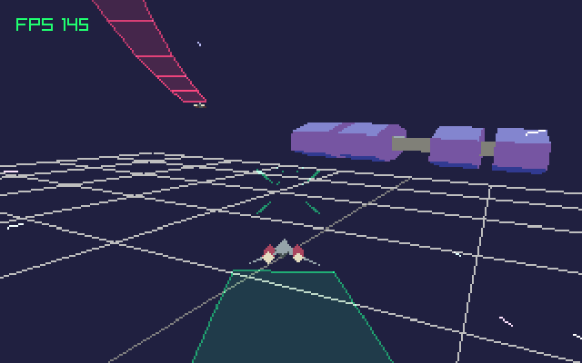

# Ergo


Fly a little ship around in a raylib project. The main purpose of this project was to figure out how to handle arbitrary rotations, since the built in rotation functions don't make this easy.

This *ended up* being another take on simple arcade space flight mechanics. Specifically, this is probably how I'd do a Rogue Squadron kind of game.

I'm really happy with the space dust and trails too. They look really neat, but I needed some help from the raylib Discord to get the transparencies working correctly. Sometimes you need to force a render batch with `rlDrawRenderBatchActive()` when messing with transparencies and the depth buffer.

The game can be controlled with either WASD/Arrow keys, or a gamepad.

## Rotations
Check `Actor.cpp` and `Ship.cpp` for some silly looking and probably very ineffecient functions to rotate a quaternion representing the ship's rotation.

Getting a forward (or any direction) vector from some actor is something that needs to be very commonly done. I'm pretty sure there's a smarter way to do this, but I get it by multiplying the forward vector by the ship's Rotation:

```cpp
Vector3 Actor::GetForward() const
{
	return Vector3RotateByQuaternion(
		Vector3{ 0, 0, 1 },
		Rotation);
}
```

Rotating an object in local space is another essential piece of code. In Unity this is a very simple [`Transform.Rotate(Vector3, Space.Self)`](https://docs.unity3d.com/ScriptReference/Transform.Rotate.html), but for raylib you have to write your own. This seemed to work.

```cpp
void Actor::RotateLocalEuler(Vector3 axis, float degrees)
{
	auto radians = degrees * DEG2RAD;
	Rotation = QuaternionMultiply(
		Rotation,
		QuaternionFromAxisAngle(axis, radians));
}
```

While not rotation specific, transforming a point from local space to world space is another essential function. In Unity this is just [`Transform.TransformPoint()`](https://docs.unity3d.com/ScriptReference/Transform.TransformPoint.html), but as far as I can tell raylib's `Transform` struct is very basic and used only by model rendering.

```cpp
Vector3 Actor::TransformPoint(Vector3 point) const
{
	auto mPos = MatrixTranslate(Position.x, Position.y, Position.z);
	auto mRot = QuaternionToMatrix(Rotation);
	auto matrix = MatrixMultiply(mRot, mPos);
	return Vector3Transform(point, matrix);
}
```

## Smoothing and Ship Flight
I've been asked about how this looks so smooth a lot, and it's [SmoothDamps all the way down](https://www.rorydriscoll.com/2016/03/07/frame-rate-independent-damping-using-lerp/). I use the SmoothDamp function in *everything* I work on because it's an easy way to add smoothing in a way that isn't (usually) affected by framerate.

```cpp
inline float SmoothDamp(float from, float to, float speed, float dt)
{
	return Lerp(from, to, 1 - expf(-speed * dt));
}
```

In this specific implementation, smoothing is applied to the inputs the player gives, and the ship's own velocity. For rotations, the smoothing is applied only to the input, not to any kind of angular velocity.

For example, here's the smoothing applied to the ship input.
```cpp
// Give the ship some momentum when accelerating.
SmoothForward = SmoothDamp(SmoothForward, InputForward, ThrottleResponse, deltaTime);
SmoothLeft = SmoothDamp(SmoothLeft, InputLeft, ThrottleResponse, deltaTime);
SmoothUp = SmoothDamp(SmoothUp, InputUp, ThrottleResponse, deltaTime);
```

After the velocity the ship should have is figured out, smoothing is applied to move the current velocity to the target velocity.
```cpp
Velocity = SmoothDamp(Velocity, targetVelocity, 2.5, deltaTime);
Position = Vector3Add(Position, Vector3Scale(Velocity, deltaTime));
```

## Arbitrary Render Resolution


There's also some messy code in there for rendering the game at an arbitrary resolution and separate from the display resolution. This is something that always interests me because I have an unhealthy rose-tinted nostalgia for DOS games.

This rendering mode can be used by uncommenting `#define RENDER_SMALL` at the top of the `Ergo.cpp`.
